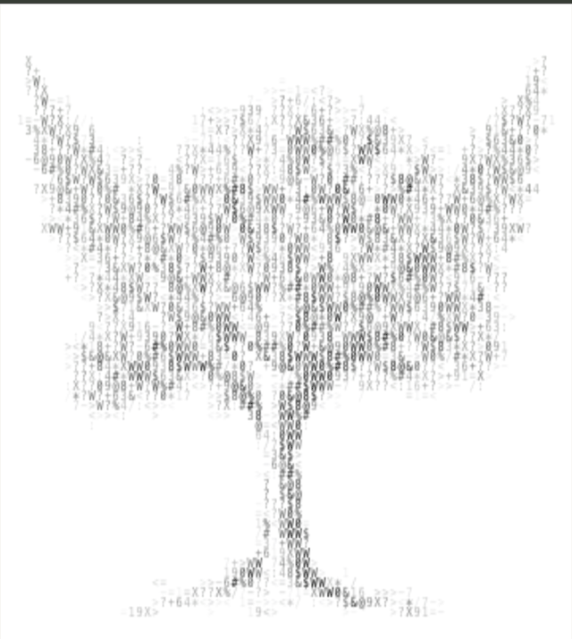

# Scan of Your Drawing

> **What if a drawing could become data — and then come back to life?**

<p align="center">
  
</p>

<p align="center">
  <a href="https://scan-of-your-drawing.adrianscriptpov.workers.dev">
    <strong>↗ Try Scan of Your Drawing</strong>
  </a>
</p>

---

## The idea

**Scan of Your Drawing** is an experimental visual system built around one simple interaction:

**Draw something → describe what should happen → watch it transform.**

The original drawing is converted into a dense field of numbers, letters and symbols.

The data then dissolves and reorganizes while AI interprets the transformation described by the user.

Instead of displaying the generated image directly, the final visual is reconstructed from characters and data.

```text
DRAWING
   ↓
PIXEL DATA
   ↓
CHARACTERS
   ↓
TRANSFORMATION
   ↓
NEW CHARACTER FORM
