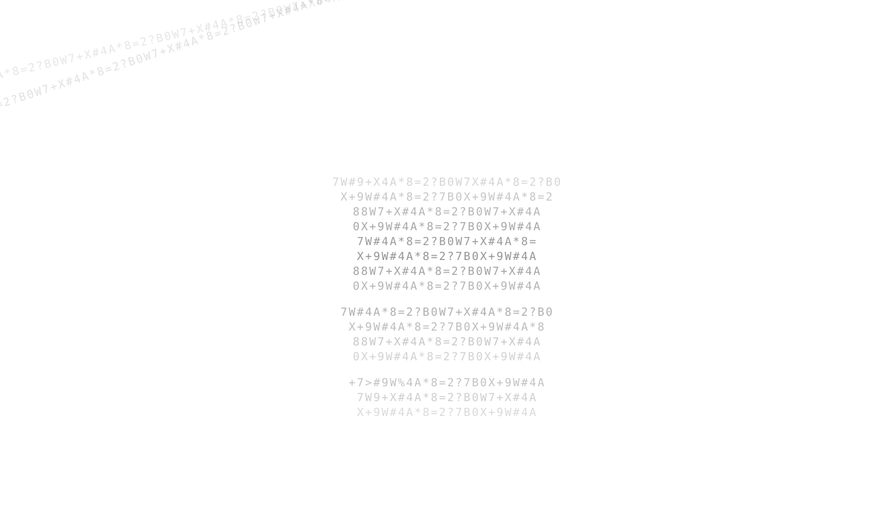

# Scan of Your Drawing

  

Scan of Your Drawing is a creative experiment that turns a hand-drawn image into a living visual transformation.  
You upload a drawing and describe what you want to happen to it in a simple sentence.  
The original drawing is analyzed at the pixel level and reconstructed as a dense field of numbers, letters, and symbols.  
That data then dissolves, moves, and reorganizes so the transformation feels like the drawing is being processed rather than replaced.  
An AI image transformation runs in the background to interpret the requested change while the original artwork remains the visual reference.  
The final result is not shown as a normal AI-generated image, but reconstructed on screen entirely from characters based on the transformed pixels.  
This creates a visual loop of **DRAWING → DATA → TRANSFORMATION → DATA → DRAWING**.  
The project uses a Cloudflare Worker, Cloudflare Workers AI, and the FLUX 2 Klein model for the transformation step.  
The interface is intentionally minimal and experimental, with responsive behavior for desktop and mobile and no traditional AI-generator dashboard.  
The goal is to explore what happens when a human drawing becomes data, changes meaning, and comes back as something new.
